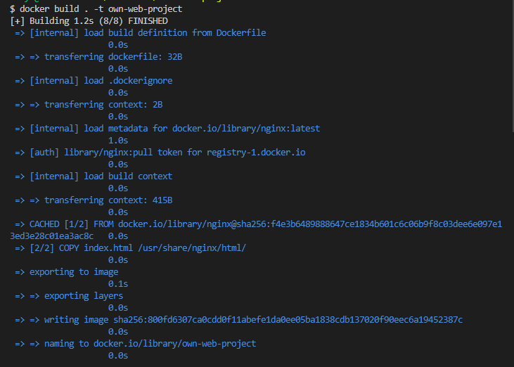

## Very simple website running in a Docker Container(Practice purposes)

### 1. Create a Dockerfile
```Docker 
# Select a base image

FROM nginx

# Label the image if need be 

# Copy the index.html file from local host to the container
COPY index.html /usr/share/nginx/html/

#Allow/ Expose ports
EXPOSE 80

# You can execute required commands

CMD ["nginx", "-g", "daemon off;"]

# nginx command starts the nginx web server  and "-g" option allows to pass a configuration directive to Nginx
# daemon off- Tells nginx to run in the foreground, prevents the container from exiting immediately after starting up
```

This file will be used to build an image based on the configuration of this Dockerfile. 
 
- We can see I used nginx base image
- We can label the image if required 
- Copy the html file from local directory to the container when created
- Allow ports
- CMD commands to be executed upon the start

---

In the same directory I created `index.html` file to store my content for the website:

```HTML
<html>
    <head>
        <title>Welcome to Marek's website</title>
    </head>
    <body>
        <h1>Private project(Marek Matyas Junior DevOps Engineer)</h1>
        <h2>This website is hosted in a Docker Container as a Micro-Service</h2>
        
    </body>
</html>
```

- I'm not very skillful in HTML language as of yet so I used a template with my own changes. 

---

Now that we have everything set up we can start putting it into work. 

1. First build an image based on the DockerFile `docker build . -t "name_of_the_image"`

**NOTE** the dot in the middle of that command specifies to use all the files and folders in the current directory. 



To see if the image was created I ran `docker images` or we can see in our Docker Desktop.

---

2. Then create and run a container using `docker run -d -p 80:80 own-web-project` using the ports we want to use, name of the image to be used for this container and it will be ran "detached" mode meaning it will run on the background. To check if created I used `docker ps` command.

---

3. For it to be public I pushed it to Docker Hub using `docker push "username"/"repoName":tag` which will create a Repository straight away if it does not exist already. 

---

4. Lastly I want to check if the website is working. Type `localhost` in the browser and the container is running then my website should be displayed. 


---


## For external use

- `docker pull marekmatyas/my-own-web-project`
- run the container
- check browser->localhost

**Possible blocker when pushing to Registry**- You might have to create a tag before pushing:
- `docker tag "imageID" "username"/"nameofImage":tag(latest)`
- Then push


# Thank you 

